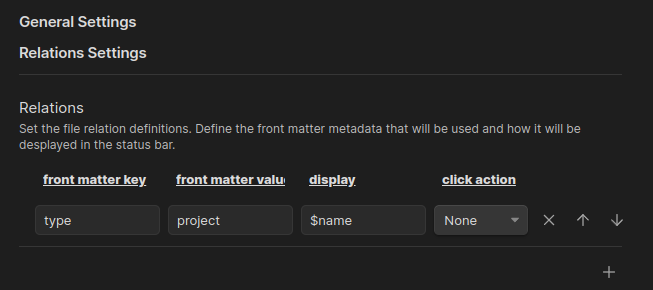
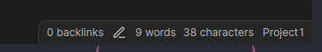
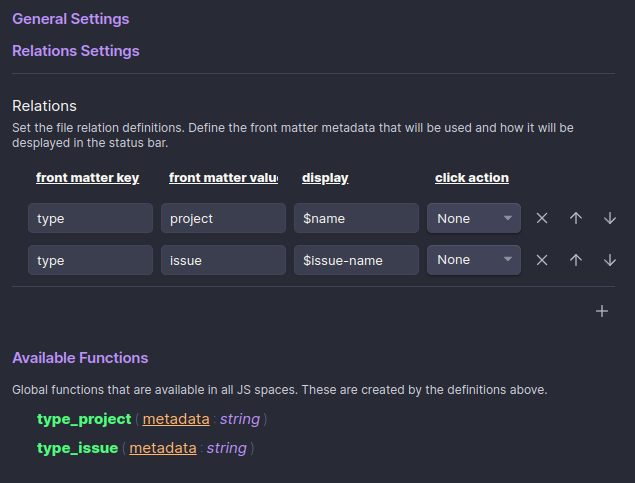
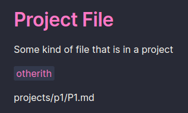

# Projects

Status Bar plugin for Projects

## Getting Started

### Using

This plugin will look at files in the same folder depth and parents to see if this might be "related" to another file. This assumes that you will be using a folder nesting structure to organize you projects and there is one file in that structure thate defines the project.

For example:

```
projects/
+ project-1/
+ + issues/
+ + + 001 this thisg.md
+ + meetings/
+ + + 230203 role call.md
+ + project1.md
+ + overview.md
```

The frontmatter for the project then can define some project specific details

```yaml
type: project
project-name: Project 1
project-code: pr1
```

And the Projects plugin settings connects which of those details defines a "project" in your vault. Each line is independent so you can have multiple things that can be "project".



Then when you are in other files, such as `230203 role call.md` you can see the project in the status bar.



#### In Other Plugins

Project adds some js functions to the main namespace so you should be able to use these anywhere you can access obsidian, such as [Templater]() or [DataviewJS]().

These are made automatically by your settings and are listed in the settings tab. You will need to reopen the settings after a change.




These can be used to show information about the "parent" in the "children file". Below shows using inline DataviewJS to display the project definition path.




### Building & Dev

- npm install
- npm run build
